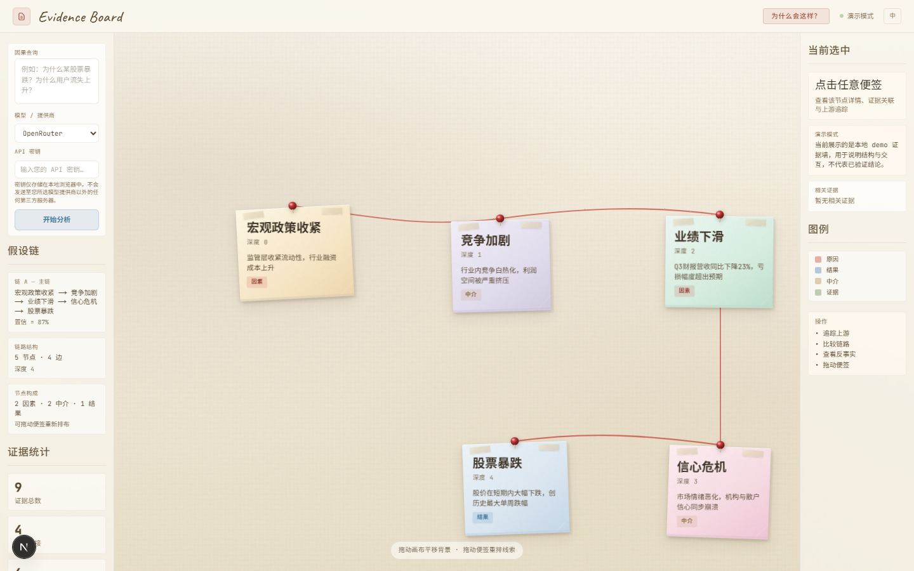
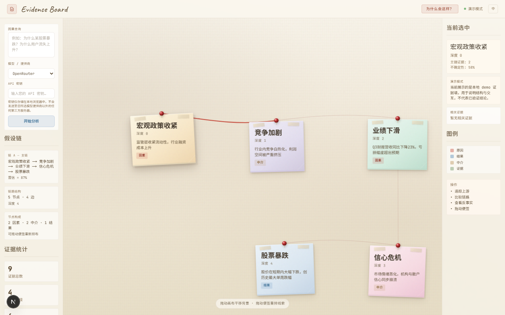
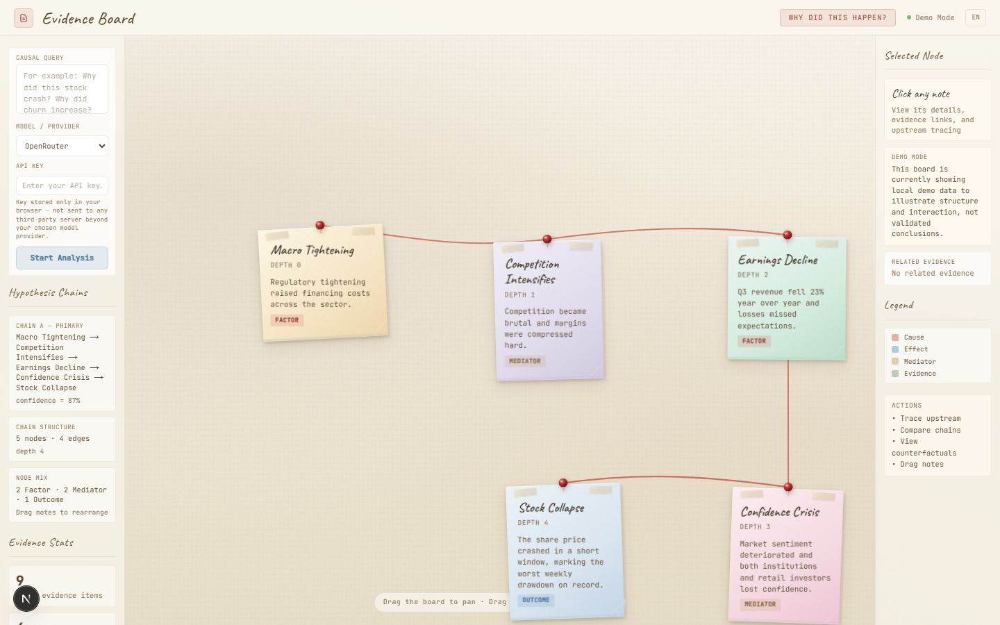

# RetroCause

**Ask any “Why did this happen?” question and get an evidence-backed causal map.**

RetroCause is an open-source causal explainer for complex events.

It helps you move beyond a single AI answer by generating:

- evidence-backed causal variables
- competing explanation chains
- intervention / what-if comparisons
- counterfactual-style reasoning signals
- an interactive causal graph you can inspect visually

Examples:

- Why did dinosaurs go extinct?
- Why did the 2008 financial crisis happen?
- Why did SVB collapse?
- Why is rent so high in New York?

---

## Why RetroCause

Most AI tools summarize information.

RetroCause is designed to explain **why** something happened:

- not just one answer, but competing explanations
- not just opinions, but evidence-linked reasoning
- not just static summaries, but intervention-style analysis

This makes it useful for developers, researchers, and early users exploring a new kind of **causal explanation interface**.

---

## Current status

RetroCause is currently a **research-grade alpha**:

- end-to-end pipeline is working
- browser-based evidence-board UI (FastAPI + Next.js)
- Streamlit demo is available as a fallback
- factor impact analysis MVP is available
- homepage now supports a minimal live `/api/analyze/v2` query flow
- demo fallback vs real analysis is explicitly labeled in the UI
- tests and frontend build are passing

Already implemented:

1. evidence collection orchestration
2. causal graph construction
3. hypothesis chain generation
4. evidence anchoring
5. counterfactual verification
6. factor impact analysis
7. interactive visualization
8. multi-hop causal tracing (API v2)
9. evidence-board web UI (Next.js frontend)

Still evolving:

- debate agents are still early
- sensitivity analysis is being expanded
- consumer-facing product polish is ongoing
- real-time streaming updates from the pipeline to the browser UI

---

## Screenshots

**Evidence board (demo mode) — sticky notes with causal strings on a cork board**



**Node selected — click any sticky note to inspect its upstream causes and evidence**



**Chinese locale — toggle between English and Chinese**



---

## Quick start

### Browser UI (recommended)

The simplest way to run the full app is the unified launcher, which starts both the FastAPI backend and the Next.js frontend:

```bash
pip install -e ".[dev]"
cd frontend && npm install && cd ..
python start.py
```

This opens:

- **Frontend**: http://localhost:3005 (evidence-board UI)
- **Backend API**: http://localhost:8000 (FastAPI, with `/api/analyze/v2`)

The homepage can now send your question to the v2 API and render the recommended chain as an interactive evidence board. When real analysis is unavailable, the UI explicitly falls back to demo mode instead of silently pretending the result is live.

The current public OSS entry point is the homepage evidence board. Some older multi-panel console components still exist in the codebase as implementation leftovers, but they are not the current public workflow and should not be treated as a stable user-facing route.

Without an API key, the UI may load demo data so you can explore the interface. This fallback is now explicitly labeled.

### CLI

```bash
pip install -e ".[dev,demo]"
retrocause "恐龙为什么灭绝？"
```

### Streamlit demo (fallback)

If you prefer the Streamlit-based demo:

```bash
pip install -e ".[dev,demo]"
streamlit run retrocause/app/entry.py
```

The demo mode works without an API key.

To use real analysis in the browser/API workflow today, configure your provider key in the backend environment (see `.env.example`).

Supported provider modes:

- OpenRouter
- OpenAI
- DashScope / 阿里百炼
- Zhipu / 智谱
- Moonshot / Kimi
- DeepSeek

This means the OSS demo now supports both:

- official domestic model endpoints
- global model endpoints
- OpenRouter as a model relay for mixed domestic + international access

---

## Example questions

Try questions like these:

### science / history

- Why did dinosaurs go extinct?
- Why did the Roman Empire collapse?
- Why did the Black Death spread so fast?

### business / tech

- Why did SVB collapse?
- Why did WeWork fail?
- Why did OpenAI's board crisis happen?

### economics / society

- Why is rent so high in New York?
- Why did the 2008 financial crisis happen?
- Why are semiconductor supply chains so fragile?

These examples are useful for demo screenshots, GitHub sharing, and early user onboarding.

---

## What the pipeline does

```text
Question
  → query decomposition
  → evidence collection from multiple sources
  → causal graph construction
  → competing hypothesis generation
  → evidence anchoring
  → counterfactual verification
  → factor intervention / impact comparison
  → multi-hop causal tracing
  → interactive explanation output (browser UI or CLI)
```

---

## Example product interaction

You ask:

> Why did dinosaurs go extinct?

The evidence-board UI shows a three-panel layout:

**Left panel**: hypothesis chains and evidence items for the current query. Each chain is listed with its probability and supporting evidence count.

**Center canvas**: the causal graph (or chain view) rendered as an interactive visualization. You can switch between graph view, chain view, and a data table. Nodes are colored by type (cause, mediator, effect) and edges show strength.

**Right panel**: when you click a node, this panel shows its detail: description, probability bar, upstream causes (clickable for multi-hop tracing), attached evidence, counterfactual analysis, and agent reports.

You can also:

- click any upstream cause to trace the chain deeper (multi-hop)
- inspect how hypothesis probabilities shift
- view counterfactual what-if scenarios for each chain
- switch between competing explanation chains

---

## What makes this different from a normal AI answer?

Typical chat tools give you a plausible explanation.

RetroCause tries to give you a more structured explanation by combining:

- causal variables
- explanation chains
- evidence links
- intervention-style comparisons

It is not claiming perfect causal truth, and it does not guarantee scientifically validated causal correctness.

It is designed to provide a **clearer and more inspectable explanation interface** with more visible uncertainty and evidence structure than a typical chat answer.

---

## Open source scope

The open-source repo is intended to be:

- runnable
- inspectable
- useful for experimentation
- good enough to demonstrate the product idea clearly

The open-source version focuses on the causal reasoning workflow itself.

The OSS release is **not** intended to be a watered-down teaser. It should stand on its own as a useful, honest, inspectable product for:

- exploring why-questions with structured causal chains
- comparing competing explanations instead of accepting one answer
- inspecting evidence coverage, confidence, and uncertainty signals
- demonstrating how a causal explanation interface differs from a normal chat response

The OSS release should be published only when it reaches a **minimally usable open-source bar**:

- the browser UI is stable and understandable
- demo fallback is explicit and honest
- docs make setup and limitations obvious
- key workflows feel coherent rather than partially stitched together

The future Pro version is expected to differentiate on **quality, workflow depth, and reliability**, not by hiding the core idea.

This is not just a product opinion. It aligns with emerging practice around:

- evidence-grounded evaluation (for example RAGAS / TruLens / factual consistency scoring)
- trust-preserving UX (explicit fallback and uncertainty handling)
- workflow-specific outputs instead of generic answer text
- reusable domain packs / templates for repeated high-value explanation jobs

Likely Pro-only areas:

- stronger real-analysis quality and reliability controls
- better source and evidence management
- richer chain comparison and scenario simulation
- saved workspaces, shareable reports, and team-facing explainability workflows
- higher-confidence templates for recurring domains such as finance, market events, and strategic postmortems

Architecture split going forward:

- **OSS stays on the current Python + FastAPI + Next.js stack** so the open-source version remains runnable, inspectable, and easy to contribute to.
- **Pro is planned as a separate full-stack Rust product line** focused on higher reliability, stronger workflow depth, and lower operating cost at scale.
- This means the OSS roadmap optimizes for honest usability and clear product learning, while the Pro roadmap can optimize for performance, streaming workflows, shared workspaces, and more operationally demanding use cases.

Some commercial and planning documents are intentionally kept local and are not pushed to the remote repository.

---

## Public docs

- `docs/market-analysis-overseas-c.md` — overseas consumer market analysis
- `docs/open-source-growth-strategy.md` — GitHub open-source growth strategy
- `docs/oss-pro-positioning.md` — OSS boundary, Pro value, pain points, and moat analysis
- `docs/engineering-audit.md` — engineering strengths, weak points, and optimization roadmap
- `docs/DECISIONS.md` — technical and product decisions
- `docs/manual-smoke-test.md` — manual smoke checklist for the OSS demo
- `docs/roadmap-and-limitations.md` — current roadmap and known limitations

---

## FAQ

### Is this a production-ready causal inference system?

No. It is currently a research-grade alpha and open-source demo product.

### Does the OSS UI clearly distinguish demo vs real analysis?

Yes.

- the homepage evidence board explicitly marks whether the current board is showing a live API result or a demo fallback
- the API now returns `is_demo` and `demo_topic`
- the Streamlit path now also shows a persistent demo warning instead of silently loading example output

### Does it need an API key?

Only for real analysis.

- the Browser UI can accept a locally entered API key directly on the homepage
- the backend can also use environment-based credentials
- without a key, the Browser UI / API / Streamlit paths fall back to clearly labeled demo data

### What is already working today?

- evidence collection orchestration
- causal graph construction
- hypothesis generation
- evidence anchoring
- counterfactual verification
- factor impact analysis MVP
- sensitivity profile MVP
- interactive visualization
- multi-hop causal tracing (API v2)
- evidence-board web UI (Next.js frontend)

### What is still early?

- debate agents
- stronger intervention math
- deeper sensitivity analysis
- consumer product polish

### What would make a future Pro version worth paying for?

Not “more AI” by itself. The strongest Pro direction is:

- higher-trust explanation quality for repeated real-world use
- more reliable evidence handling and comparison workflows
- better outputs for teams who need to explain causality to clients, teammates, or decision-makers
- domain-specific templates where being wrong is costly and uncertainty must be explicit
- a more operationally robust product architecture, currently planned as a separate **full-stack Rust** implementation rather than a thin feature flag layer on top of OSS

In other words: OSS should make the product understandable and usable; Pro should make it dependable enough for higher-frequency and higher-stakes workflows.

### Is this open source?

Yes. The code in this repository is open source under MIT.

Some business and planning documents are intentionally kept local and are not pushed to the remote repository.

---

## For GitHub visitors

If you are landing here from X, Reddit, Hacker News, or Product Hunt:

1. run `python start.py` to launch the browser UI
2. try one of the example questions above
3. click a node, then trace upstream causes (multi-hop)
4. switch between hypothesis chains to compare explanations
5. open an issue if you want a new example or feature

---

## Tech stack

| Area | Tech |
|---|---|
| causal graph | NetworkX |
| LLM orchestration | OpenAI SDK / OpenRouter-compatible API |
| pipeline | custom pipeline abstraction |
| probabilistic reasoning groundwork | NumPyro / JAX |
| backend API | FastAPI (Python) with `/api/analyze/v2` |
| frontend | Next.js + Tailwind CSS (evidence-board UI) |
| interface (fallback) | Streamlit + streamlit-agraph |

Current OSS runtime architecture (high level):

| Layer | Current OSS implementation |
|---|---|
| launcher | `start.py` starts FastAPI (`:8000`) + Next.js (`:3005`) |
| API contract | `retrocause/api/main.py` exposes `/api/analyze/v2`, `/api/providers`, demo/real metadata |
| inference runtime | `retrocause/engine.py` staged pipeline: evidence -> graph -> hypotheses -> anchoring -> counterfactual -> debate -> evaluation |
| evidence sources | `retrocause/sources/*` adapters for DuckDuckGo, ArXiv, Semantic Scholar |
| model routing | `retrocause/llm.py` + provider config in `retrocause/app/demo_data.py` |
| browser product surface | Next.js evidence-board homepage + interactive graph/canvas panels |
| fallback UX | Streamlit path remains available as a demo-oriented backup interface |

Planned future Pro architecture (private planning direction):

- frontend: Dioxus (Rust)
- backend: Axum (Rust)
- graph engine: petgraph
- shared typed models across client/server
- Python remains in the loop only where mature probabilistic tooling is still worth bridging (for example via PyO3 + NumPyro)

Frontier capability placement (current recommendation):

| Capability | OSS now / next | Pro-first |
|---|---|---|
| evidence-grounded evaluation | ✅ yes |
| citation-grounded outputs | ✅ yes |
| support vs refutation balance | ✅ yes |
| lightweight CausalRAG / graph-guided retrieval | ✅ yes |
| explicit uncertainty communication | ✅ yes |
| strong provenance ledger / reusable workspaces |  | ✅ yes |
| streaming long-running analysis workflows |  | ✅ yes |
| domain packs / repeated-use workflow templates |  | ✅ yes |
| heavy multi-agent orchestration |  | ✅ yes |
| team/client report workflows |  | ✅ yes |

Rule of thumb:

- **OSS** should improve inspectability, honesty, and explanation quality.
- **Pro** should improve operational reliability, repeated workflow depth, and collaborative usefulness.

---

## Validation

Current local validation includes:

- `pytest tests/` passing (127 tests: unit, integration, comprehensive boundary)
- `ruff check` on all source and test files
- diagnostics clean on source files (39 Python files + frontend)
- frontend build (`npm run build`) passing in `frontend/`
- real data sources (ArXiv, Semantic Scholar, DuckDuckGo) confirmed live
- API smoke test (`scripts/smoke_test.py`): 38/38 PASS — backend root, V2 API (5 demo topics), V1 compat, edge variable integrity, frontend HTML
- UI smoke test (`scripts/ui_smoke_test.py`): 21/21 PASS — Playwright/Chromium headless tests covering initial load, demo transparency, query flow, node click/multi-hop, language toggle

---

## Vision

RetroCause is moving toward a consumer-facing product where people can ask:

> Why did this happen?

and receive a clearer, more structured, more evidence-aware explanation than a normal chat response.

---

## License

MIT
