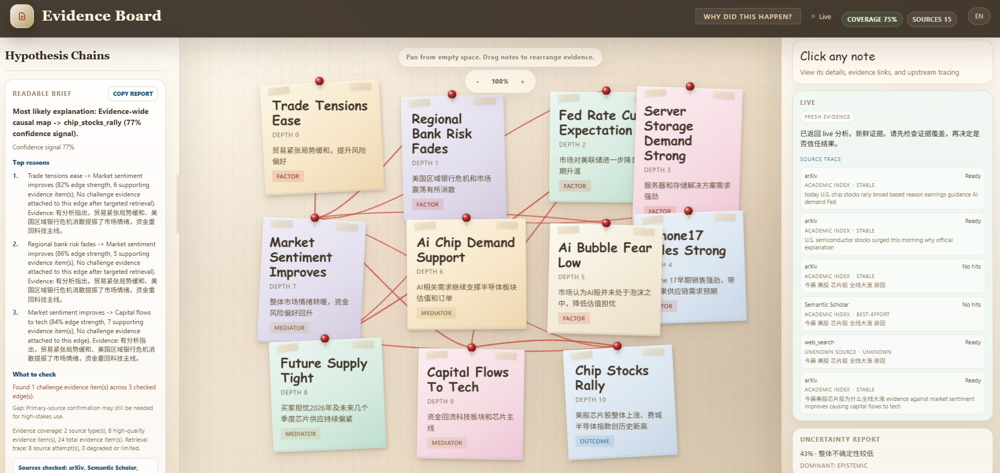

# RetroCause

**English:** Ask "why did this happen?" and inspect an evidence-backed causal map.

**中文：** 输入一个“为什么会这样？”的问题，查看带证据、反证检查、来源轨迹和不确定性提示的因果解释。

RetroCause is an open-source causal explanation workspace for complex events. It is not a truth oracle and it is not a production causal-inference system. Its goal is to make AI-assisted explanations inspectable: users can see proposed reasons, supporting evidence, challenge checks, uncertainty signals, and retrieval-source health instead of receiving one opaque paragraph.

RetroCause 是一个开源的因果解释工作台，用来研究复杂事件的“原因链”。它不是因果真理机器，也不是生产级科学因果推断系统。它的目标是让 AI 辅助解释更可检查：用户可以看到原因、证据、反证检查、不确定性和检索来源健康状态，而不是只看到一段不可追踪的总结。



## Current Status / 当前状态

RetroCause is currently a stable-deliverable local OSS alpha focused on inspectable causal analysis. It is ready to clone, run, and evaluate locally. It is not a hosted service, and future Pro should still be planned as a separate full-stack Rust rewrite instead of extending the current Python/FastAPI + Next.js stack into hosted infrastructure.

RetroCause 目前是一个稳定可交付的本地 OSS alpha，重点是可检查的因果分析。它已经可以被 clone、启动并在本地评估使用。它不是托管服务，未来 Pro 仍应作为独立的全栈 Rust 重写来规划，而不是继续把当前 Python/FastAPI + Next.js 栈往托管基础设施方向堆叠。

Current delivery gate: on 2026-04-23, both the active workspace and a fresh local copy passed the documented install steps plus the full root `npm test` workflow on Windows. The latest public GitHub release is still `v0.1.0-alpha.5`; see [`docs/oss-release-gate.md`](docs/oss-release-gate.md) for the non-alpha `v0.1.0` release bar.

当前交付门槛：在 2026-04-23，当前工作区和一个全新的本地副本都按文档完成了安装，并通过了根目录完整 `npm test` 流程。当前公开 GitHub release 仍然是 `v0.1.0-alpha.5`；非 alpha 的 `v0.1.0` 发布门槛见 [`docs/oss-release-gate.md`](docs/oss-release-gate.md)。


What works locally:

- FastAPI backend and Next.js browser app
- demo / partial-live / live result labeling
- provider preflight for OpenAI-compatible models
- evidence-backed causal chains
- readable brief and copyable Markdown research brief
- challenge/refutation coverage
- SourceBroker retrieval trace with cached, rate-limited, source-limited, timeout, and source-error states
- scenario-aware brief modes for market, policy/geopolitics, and postmortem questions
- local run metadata, usage ledger, saved runs, and pasted uploaded evidence
- full local verification through `npm test`

本地已经可用：

- FastAPI 后端和 Next.js 浏览器应用
- demo / partial-live / live 结果标记
- OpenAI-compatible 模型预检
- 带证据的因果链
- 可阅读简报和可复制 Markdown 研究简报
- 反证 / challenge coverage
- SourceBroker 来源轨迹，包括缓存、限流、来源受限、超时和来源错误等状态
- 面向市场、政策 / 地缘政治、复盘问题的场景化简报
- 本地 run metadata、usage ledger、saved runs、粘贴式 uploaded evidence
- 通过 `npm test` 的完整本地验证

Known limits:

- Results are evidence-grounded explanations, not verified causal truth.
- Live quality depends on source availability, model behavior, API quota, and provider rate limits.
- Source trace rows describe retrieval health. They are not evidence for or against a cause by themselves.
- Saved runs and uploaded evidence are local OSS features. They are not hosted storage, team sharing, ACLs, or secure document management.
- PDF/DOCX export, scheduled watch topics, team review, branded reports, and hosted queues are not part of the OSS release.
- Some generated labels may remain partly English in Chinese mode, but live graph nodes should keep their specific meaning.

已知限制：

- 结果是“证据锚定的解释”，不是已经被证明的因果真理。
- Live 模式质量取决于来源可用性、模型行为、API 额度和 provider 限流。
- 来源轨迹描述的是检索健康状态，它本身不是支持或反驳某个原因的证据。
- saved runs 和 uploaded evidence 是本地 alpha 功能，不是托管存储、团队共享、ACL 或安全文档管理。
- PDF/DOCX 导出、定时主题、团队审阅、品牌化报告、托管队列不属于当前 OSS alpha。
- 中文模式下，部分模型生成的长标签可能仍保留英文，但 live graph 节点应该保留具体含义。

## Quick Start / 快速开始

### 1. Install / 安装

Use Python 3.10+ and Node.js. From the repository root:

```bash
pip install -e ".[dev]"
npm install
npm --prefix frontend install
```

使用 Python 3.10+ 和 Node.js。在仓库根目录执行：

```bash
pip install -e ".[dev]"
npm install
npm --prefix frontend install
```

### 2. Start / 启动

```bash
python start.py
```

Open:

- Frontend: `http://127.0.0.1:3005`
- Backend API: `http://127.0.0.1:8000`

打开：

- 前端：`http://127.0.0.1:3005`
- 后端 API：`http://127.0.0.1:8000`

### 3. Try Demo Mode / 先试 Demo

Submit a question without an API key. RetroCause will show clearly labeled demo output so you can inspect the interface safely.

不填 API key 也可以提交问题。RetroCause 会显示明确标记的 demo 输出，方便先检查界面、证据墙和因果链。

Example questions:

- Why did SVB collapse?
- Why did the 2008 financial crisis happen?
- Why is rent so high in New York?
- Why did Bitcoin move today?
- Why did a SaaS product launch fail to convert trial users?

示例问题：

- SVB 为什么倒闭？
- 2008 年金融危机的原因是什么？
- 纽约房租为什么这么高？
- 比特币今天为什么波动？
- 一个 SaaS 产品发布后为什么没能把试用用户转成付费用户？

### 4. Run Live Analysis / 跑真实分析

1. Open **Model settings** on the homepage.
2. Paste your OfoxAI or OpenAI-compatible API key.
3. Click **Run model preflight**.
4. Optionally paste Tavily or Brave Search keys and click **Run search preflight**.
5. Choose **Auto detect**, **Market / Investment**, **Policy / Geopolitics**, or **Postmortem**.
6. For a Chinese A-share smoke test, click the sample query button; it fills the query and selects **Market / Investment**.
7. If preflight passes, click **Start analysis**.
8. Inspect the production brief, analysis brief, source trace, challenge coverage, and value harness before trusting the result.
9. Use **Copy report** to export the Markdown research brief.

步骤：

1. 打开首页的 **Model settings**。
2. 粘贴 OfoxAI 或 OpenAI-compatible API key。
3. 点击 **Run model preflight**。
4. 可选：粘贴 Tavily 或 Brave Search key，并点击 **Run search preflight**。
5. 选择 **Auto detect**、**Market / Investment**、**Policy / Geopolitics** 或 **Postmortem**。
6. 如果要做中文 A 股 smoke test，点击示例问题按钮；它会填入问题并选择 **Market / Investment**。
7. 预检通过后点击 **Start analysis**。
8. 先检查 production brief、analysis brief、source trace、challenge coverage 和 value harness，再决定是否信任结果。
9. 使用 **Copy report** 导出 Markdown 研究简报。

API keys are only needed for live analysis. Without a key, the app remains usable in demo mode.

只有真实分析需要 API key。没有 key 时，应用仍可用 demo 模式体验。

## Model Providers / 模型提供商

OfoxAI is the default local provider path. It uses the OpenAI-compatible base URL `https://api.ofox.ai/v1`, with `openai/gpt-5.4-mini` selected first.

OfoxAI 是默认的本地模型提供商路径。它使用 OpenAI-compatible base URL `https://api.ofox.ai/v1`，默认优先选择 `openai/gpt-5.4-mini`。

OpenRouter remains available as a fallback provider. Always run provider preflight before a full live run.

OpenRouter 仍作为 fallback provider 保留。每次完整 live run 前都应该先运行 provider preflight。

When a live run fails before producing a usable causal chain, the UI and V2 response surface the next best action instead of silently pretending the run succeeded.

如果 live run 在产生可用因果链前失败，UI 和 V2 响应会明确提示下一步，而不是假装分析已经成功。


## Optional Hosted Search Sources / 可选托管检索源

RetroCause OSS works without hosted-search accounts. If you want stronger live web retrieval, you can either paste a Tavily or Brave Search key into **Provider settings** for one run or set environment variables before startup.

RetroCause OSS 不依赖托管检索账号。可选托管适配器有两种本地使用方式：在 **Provider settings** 里为单次 run 粘贴 Tavily 或 Brave Search key，或在启动应用前设置环境变量。

Windows CMD:

```bat
set TAVILY_API_KEY=your_tavily_key
set BRAVE_SEARCH_API_KEY=your_brave_key
python start.py
```

PowerShell:

```powershell
$env:TAVILY_API_KEY = "your_tavily_key"
$env:BRAVE_SEARCH_API_KEY = "your_brave_key"
python start.py
```

- `TAVILY_API_KEY` enables Tavily Search.
- `BRAVE_SEARCH_API_KEY` enables Brave Search.
- Per-run search keys entered in the browser override process environment keys for that local analysis only.
- If no hosted search keys are provided, RetroCause uses the built-in OSS source adapters.
- Hosted providers may still rate-limit requests.

- `TAVILY_API_KEY` 启用 Tavily Search。
- `BRAVE_SEARCH_API_KEY` 启用 Brave Search。
- 浏览器中输入的 per-run search key 只覆盖当前本地分析，不会写入项目配置。
- 未提供托管 search key 时，RetroCause 使用内置 OSS source adapter。
- 托管 provider 仍然可能限流。

## Local Workflow Features / 本地工作流功能

The OSS release includes small local workflow features because they make inspection easier:

- Run status: every V2 analysis response includes a local `run_id`, status, run steps, and usage ledger.
- Saved runs: recent run payloads can be reopened from the browser UI.
- Uploaded evidence: pasted notes can be stored locally and reused as user-provided evidence.

OSS 版本包含一些小型本地工作流功能，因为它们能让检查过程更清楚：

- Run status：每个 V2 分析响应包含本地 `run_id`、状态、步骤和 usage ledger。
- Saved runs：最近的运行结果可以在浏览器 UI 中重新打开。
- Uploaded evidence：用户粘贴的笔记可以存入本地 evidence store，作为用户提供的证据复用。

These are local inspectability features. They are not hosted Pro infrastructure.

这些是本地可检查性功能，不是 hosted Pro 基础设施。

## API Usage / API 用法

Run the backend with `python start.py`, then call:

```bash
curl -X POST http://127.0.0.1:8000/api/analyze/v2 \
  -H "Content-Type: application/json" \
  -d "{\"query\":\"Why did SVB collapse?\"}"
```

Useful local endpoints:

- `POST /api/analyze/v2`
- `POST /api/providers/preflight`
- `POST /api/sources/preflight`
- `GET /api/runs`
- `GET /api/runs/{run_id}`
- `POST /api/evidence/upload`

Windows PowerShell note: for Chinese queries, send UTF-8 JSON bytes. Plain string request bodies can corrupt Chinese text on some Windows consoles.

Windows PowerShell 注意：中文问题建议发送 UTF-8 JSON bytes。某些 Windows 控制台直接发送字符串 body 时，中文可能被破坏。

## Development / 开发验证

Run the full local verification suite:

```bash
npm test
```

This covers frontend lint/build, backend lint, pytest, and the browser E2E smoke path.

这会覆盖前端 lint/build、后端 lint、pytest，以及浏览器 E2E smoke path。

## When To Use It / 适用场景

RetroCause is useful when a user needs to explain an event and inspect the reasoning path:

- market or policy event explanations
- Chinese A-share intraday questions such as `芯原股份今天盘中为什么下跌？`
- geopolitical/news causal briefings
- company or competitor postmortems
- research demos for evidence-grounded explanation UX

RetroCause 适合需要“解释事件原因，并检查推理链”的场景：

- 市场或政策事件解释
- 中文 A 股盘中问题，例如 `芯原股份今天盘中为什么下跌？`
- 地缘政治 / 新闻因果简报
- 公司或竞品复盘
- 证据锚定解释 UX 的研究 demo

## OSS vs Future Pro / OSS 与未来 Pro

**OSS:** local, inspectable analysis for individual researchers and builders. OSS includes the evidence board, source trace, challenge coverage, value harness, scenario-aware single-run briefs, optional user-key hosted search adapters, local saved runs, pasted uploaded evidence, and a copyable Markdown research brief.

**Future Pro:** deferred until OSS is solid. Future Pro should be designed as a separate full-stack Rust rewrite focused on hosted reliability, durable queues, workspace storage, exports, scheduled watch topics, review workflows, and source-policy controls.

**OSS：** 面向个人研究者和开发者，重点是本地可运行、可检查、可复制。OSS 包含证据墙、来源轨迹、反证覆盖、value harness、场景化单次简报、用户自带 key 的可选托管检索源、本地 saved runs、粘贴式 uploaded evidence、可复制 Markdown 研究简报。

**未来 Pro：** 等 OSS 稳定后再规划。未来 Pro 应作为独立全栈 Rust 重写，重点是托管可靠性、持久队列、工作区存储、导出、定时主题、审阅流程和来源策略控制。

## License / 许可证

MIT
