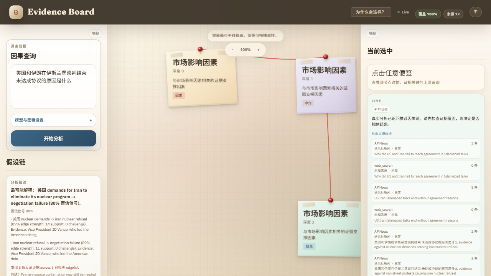

# RetroCause

**English:** Ask "why did this happen?" and inspect an evidence-backed causal map.

**中文：** 输入一个“为什么会这样？”的问题，查看带证据、反证检查、来源轨迹和不确定性提示的因果解释。

RetroCause is an open-source causal explanation workspace for complex events. It is not a truth oracle and it is not a production causal-inference system. Its goal is to make AI-assisted explanations inspectable: users can see proposed reasons, supporting evidence, challenge checks, uncertainty signals, and retrieval-source health instead of receiving one opaque paragraph.

RetroCause 是一个开源的因果解释工作台，用来研究复杂事件的“原因链”。它不是因果真理机器，也不是生产级科学因果推断系统。它的目标是让 AI 输出更可检查：用户可以看到原因、证据、反证检查、不确定性和检索来源健康状态，而不是只看到一段不可追踪的总结。



## Current Status / 当前状态

RetroCause is a research-grade OSS alpha. The current priority is to finish the OSS version before adding more Pro behavior. Future Pro should be planned as a separate full-stack Rust rewrite, not as more hosted features bolted onto this Python/FastAPI + Next.js alpha.

RetroCause 目前是 research-grade OSS alpha。当前优先级是先把 OSS 版本做好，再考虑 Pro。未来 Pro 应该作为独立的全栈 Rust 重构来规划，而不是继续在当前 Python/FastAPI + Next.js alpha 上堆托管功能。

Documentation map: [`docs/INDEX.md`](docs/INDEX.md). Current code/documentation audit: [`docs/codebase-audit.md`](docs/codebase-audit.md).

文档索引见 [`docs/INDEX.md`](docs/INDEX.md)。当前代码与文档审计见 [`docs/codebase-audit.md`](docs/codebase-audit.md)。

What works locally:

- FastAPI backend and Next.js browser app
- demo / partial-live / live result labeling
- provider preflight for OpenAI-compatible models
- evidence-backed causal chains
- readable brief and copyable Markdown research brief
- challenge/refutation coverage
- SourceBroker retrieval trace with cached, rate-limited, source-limited, timeout, and source-error states
- scenario-aware brief modes for market, policy/geopolitics, and postmortem questions
- local run metadata, usage ledger, saved runs, and pasted uploaded evidence
- full local verification through `npm test`

本地已经可用：

- FastAPI 后端和 Next.js 浏览器应用
- demo / partial-live / live 结果标记
- OpenAI-compatible 模型预检
- 带证据的因果链
- 可阅读简报和可复制 Markdown 研究简报
- 反证 / challenge coverage
- SourceBroker 来源轨迹，包括缓存、限流、来源受限、超时、来源错误等状态
- 面向市场、政策 / 地缘政治、复盘问题的场景化简报
- 本地 run metadata、usage ledger、saved runs、粘贴式 uploaded evidence
- 通过 `npm test` 的完整本地验证

Known limits:

- Results are evidence-grounded explanations, not verified causal truth.
- Live quality depends on source availability, model behavior, API quota, and provider rate limits.
- Source trace rows describe retrieval health. They are not evidence for or against a cause by themselves.
- Saved runs and uploaded evidence are local alpha features. They are not hosted storage, team sharing, ACLs, or secure document management.
- PDF/DOCX export, scheduled watch topics, team review, branded reports, and hosted queues are not part of the OSS alpha.
- Some generated labels may remain partly English in Chinese mode, but live graph nodes should keep their specific meaning.

已知限制：

- 结果是“证据锚定的解释”，不是已经被证明的因果真理。
- Live 模式质量取决于来源可用性、模型行为、API 额度和 provider 限流。
- 来源轨迹描述的是检索健康状态，它本身不是支持或反驳某个原因的证据。
- saved runs 和 uploaded evidence 是本地 alpha 功能，不是托管存储、团队共享、ACL 或安全文档管理。
- PDF/DOCX 导出、定时主题、团队审阅、品牌化报告、托管队列不属于当前 OSS alpha。
- 中文模式下，部分模型生成的长标签可能仍保留英文，但 live graph 节点应保留具体含义。

## Quick Start / 快速开始

### 1. Install / 安装

Use Python 3.10+ and Node.js. From the repository root:

```bash
pip install -e ".[dev]"
npm install
npm --prefix frontend install
```

使用 Python 3.10+ 和 Node.js。在仓库根目录执行：

```bash
pip install -e ".[dev]"
npm install
npm --prefix frontend install
```

### 2. Start / 启动

```bash
python start.py
```

Open:

- Frontend: `http://localhost:3005`
- Backend API: `http://localhost:8000`

打开：

- 前端：`http://localhost:3005`
- 后端 API：`http://localhost:8000`

### 3. Try Demo Mode / 先试 Demo

Submit a question without an API key. RetroCause will show clearly labeled demo output so you can inspect the interface safely.

不填 API key 也可以提交问题。RetroCause 会显示明确标记的 demo 输出，方便先检查界面、证据墙和因果链。

Example questions:

- Why did SVB collapse?
- Why did the 2008 financial crisis happen?
- Why is rent so high in New York?
- Why did Bitcoin move today?
- Why did a SaaS product launch fail to convert trial users?

示例问题：

- SVB 为什么倒闭？
- 2008 年金融危机的原因是什么？
- 纽约房租为什么这么高？
- 比特币今天为什么波动？
- 一个 SaaS 产品发布后为什么没能把试用用户转成付费用户？

### 4. Run Live Analysis / 跑真实分析

1. Open **Model settings** on the homepage.
2. Paste your OpenRouter or OpenAI-compatible API key.
3. Click **Run model preflight**.
4. Choose **Auto detect**, **Market / Investment**, **Policy / Geopolitics**, or **Postmortem**.
5. For a Chinese A-share smoke test, click the sample query for `芯原股份今天盘中为什么下跌？`; it fills the query and selects **Market / Investment**.
6. If preflight passes, click **Start analysis**.
7. Inspect the production brief, analysis brief, source trace, challenge coverage, and value harness before trusting the result.
8. Use **Copy report** to export the Markdown research brief.

步骤：

1. 打开首页的 **Model settings**。
2. 粘贴 OpenRouter 或 OpenAI-compatible API key。
3. 点击 **Run model preflight**。
4. 选择 **Auto detect**、**Market / Investment**、**Policy / Geopolitics** 或 **Postmortem**。
5. 预检通过后点击 **Start analysis**。
6. 先检查 production brief、analysis brief、source trace、challenge coverage 和 value harness，再决定是否信任结果。
7. 使用 **Copy report** 导出 Markdown 研究简报。

API keys are only needed for live analysis. Without a key, the app remains usable in demo mode.

只有真实分析需要 API key。没有 key 时，应用仍可用 demo 模式体验。

## Optional Hosted Search Sources / 可选托管检索源

RetroCause OSS works without hosted-search accounts. Optional hosted adapters are only registered when you provide keys before starting the app.

RetroCause OSS 不依赖托管检索账号。只有在启动前提供 key 时，可选托管适配器才会注册。

Windows CMD:

```bat
set TAVILY_API_KEY=your_tavily_key
set BRAVE_SEARCH_API_KEY=your_brave_key
python start.py
```

PowerShell:

```powershell
$env:TAVILY_API_KEY = "your_tavily_key"
$env:BRAVE_SEARCH_API_KEY = "your_brave_key"
python start.py
```

- `TAVILY_API_KEY` enables Tavily Search.
- `BRAVE_SEARCH_API_KEY` enables Brave Search.
- If those variables are absent, RetroCause uses the built-in OSS source adapters.
- Hosted providers may enforce rate limits or storage rules. RetroCause exposes those limits in source trace instead of hiding them.
- The default OpenRouter model uses the current DeepSeek stable alias (`deepseek/deepseek-chat`) instead of the older DeepSeek V3 0324 snapshot. The 0324 snapshot remains available as an explicit legacy option for comparison.

- `TAVILY_API_KEY` 启用 Tavily Search。
- `BRAVE_SEARCH_API_KEY` 启用 Brave Search。
- 未设置这些变量时，RetroCause 使用内置 OSS 检索源。
- 托管 provider 可能有额度、限流或存储规则。RetroCause 会把这些限制显示在 source trace 里，而不是假装检索成功。

## Local Workflow Features / 本地工作流功能

The OSS alpha includes small local workflow features because they make inspection easier:

- Run status: every V2 analysis response includes a local `run_id`, status, run steps, and usage ledger.
- Saved runs: recent run payloads can be reopened from the browser UI.
- Uploaded evidence: pasted notes can be stored locally and reused as user-provided evidence.

OSS alpha 包含一些小型本地工作流功能，因为它们能让检查过程更清楚：

- Run status：每个 V2 分析响应包含本地 `run_id`、状态、步骤和 usage ledger。
- Saved runs：最近的运行结果可以在浏览器 UI 中重新打开。
- Uploaded evidence：用户粘贴的笔记可以存入本地 evidence store，作为用户提供的证据复用。

These are local inspectability features. They are not hosted Pro infrastructure.

这些是本地可检查性功能，不是 hosted Pro 基础设施。

## API Usage / API 用法

Run the backend with `python start.py`, then call:

```bash
curl -X POST http://localhost:8000/api/analyze/v2 \
  -H "Content-Type: application/json" \
  -d "{\"query\":\"Why did SVB collapse?\"}"
```

Provider preflight:

```bash
curl -X POST http://localhost:8000/api/providers/preflight \
  -H "Content-Type: application/json" \
  -d "{\"model\":\"openrouter\",\"explicit_model\":\"deepseek/deepseek-chat\",\"api_key\":\"YOUR_KEY\"}"
```

Saved runs:

```bash
curl http://localhost:8000/api/runs
curl http://localhost:8000/api/runs/run_example
```

Uploaded evidence:

```bash
curl -X POST http://localhost:8000/api/evidence/upload \
  -H "Content-Type: application/json" \
  -d "{\"query\":\"Why did the launch underperform?\",\"content\":\"User interviews point to unclear onboarding.\",\"title\":\"Interview notes\"}"
```

Windows PowerShell note: for Chinese queries, send UTF-8 JSON bytes. Plain string request bodies can corrupt Chinese text on some Windows consoles.

Windows PowerShell 注意：中文问题建议用 UTF-8 JSON bytes 发送。某些 Windows 控制台直接发送字符串 body 时，中文可能被破坏。

## Secondary Entry Points / 次要入口

The supported first-run path is the browser evidence board started by `python start.py`. The repository also contains two secondary development entry points:

- `retrocause`: a CLI command installed from `pyproject.toml`. Use it for quick local smoke checks or scripting. It is not the primary OSS product surface.
- Streamlit demo: install `pip install -e ".[demo]"` and run `streamlit run retrocause/app/entry.py`. This is a legacy/development demo path, not the current browser evidence board.

The preferred API is `/api/analyze/v2`. The legacy `/api/analyze` endpoint remains for compatibility but is not the recommended integration path for new work.

推荐的首次运行路径是通过 `python start.py` 打开的浏览器 evidence board。本仓库还保留两个次要开发入口：

- `retrocause`：由 `pyproject.toml` 安装的 CLI 命令，适合快速本地 smoke check 或脚本使用，不是当前 OSS 产品主入口。
- Streamlit demo：安装 `pip install -e ".[demo]"` 后运行 `streamlit run retrocause/app/entry.py`。这是 legacy/development demo 路径，不是当前浏览器 evidence board。

推荐 API 是 `/api/analyze/v2`。旧的 `/api/analyze` 端点仅作为兼容路径保留，新集成不建议使用。

## Development / 开发

Run the full local verification suite:

```bash
npm test
```

This runs:

- frontend lint
- frontend build
- `ruff check retrocause/`
- `pytest tests/ --basetemp=.pytest-tmp`
- full-stack E2E smoke tests

## Tech Stack / 技术栈

- Backend: Python, FastAPI, OpenAI-compatible SDK
- Frontend: Next.js, React, Tailwind CSS
- Causal graph: NetworkX
- Probabilistic reasoning groundwork: NumPyro / JAX
- Evidence sources: web search adapters, AP News, Federal Register, GDELT, ArXiv, Semantic Scholar, optional Tavily, optional Brave Search
- Retrieval strategy: [`docs/retrieval-and-output-strategy.md`](docs/retrieval-and-output-strategy.md)
- Pro direction note: [`docs/pro-workflow-spec.md`](docs/pro-workflow-spec.md)

## When To Use It / 适合什么场景

RetroCause is useful when a user needs to explain an event and inspect the reasoning path:

- market or policy event explanations
- Chinese A-share intraday questions such as `芯原股份今天盘中为什么下跌？`
- geopolitical/news causal briefings
- company or competitor postmortems
- research demos for evidence-grounded explanation UX

RetroCause 适合需要“解释事件原因，并检查推理链”的场景：

- 市场或政策事件解释
- 地缘政治 / 新闻因果简报
- 公司或竞品复盘
- 证据锚定解释 UX 的研究 demo

## OSS vs Future Pro / OSS 与未来 Pro

**OSS:** local, inspectable analysis for individual researchers and builders. OSS includes the evidence board, source trace, challenge coverage, value harness, scenario-aware single-run briefs, optional user-key hosted search adapters, local saved runs, pasted uploaded evidence, and a copyable Markdown research brief.

**Future Pro:** deferred until OSS is solid. Future Pro should be designed as a separate full-stack Rust rewrite focused on hosted reliability, durable queues, workspace storage, exports, scheduled watch topics, review workflows, and source-policy controls.

**OSS：** 面向个人研究者和开发者，重点是本地可运行、可检查、可复制。OSS 包含证据墙、来源轨迹、反证覆盖、value harness、场景化单次简报、用户自带 key 的可选托管检索源、本地 saved runs、粘贴式 uploaded evidence、可复制 Markdown 研究简报。

**未来 Pro：** 等 OSS 稳定后再规划。未来 Pro 应作为独立全栈 Rust 重构，重点是托管可靠性、持久队列、工作区存储、导出、定时主题、审阅流程和来源策略控制。

## License / 许可证

MIT
